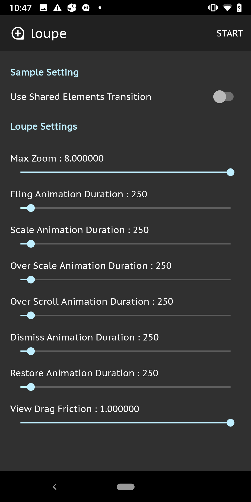

# Loupe [](https://android-arsenal.com/details/1/8047)

Loupe is an ImageView Helper for Android that supports `pinch-to-zoom` and `swipe-to-dismiss` gesture.


Loupe provides modern image viewer ui by super simple code.
You can implement the Twitter-like image viewer in 10 minutes.


## Download

Project `build.gradle` 

```groovy
repositories {
    mavenCentral()
}
```
App `build.gradle`

```groovy
dependencies {
    implementation 'io.github.igreenwood.loupe:loupe:1.2.2'
    // optional
    implementation 'io.github.igreenwood.loupe:extensions:1.0.1'
}
```
You can check the released version [here](https://repo1.maven.org/maven2/io/github/igreenwood/loupe/).

## Quick Start

Let's think about simple `Master/Detail Flow`. 
(If the user taps the image in `MasterActivity`, it will open `DetailActivity` and full screen image shows.
Once the user swipe down the image in `DetailActivity`, it will close `DetailActivity` and back to `MasterActivity`.)

### Use `Fling-To-Dismiss Gesture`

If you do not use `Shared Element Transition`, you don't need to any additional code to `MasterActivity.kt`.

#### 1. In your `activity_detail.xml`, wrap your full screen `ImageView` with `ViewGroup` like `FrameLayout` (except for ViewPager).

This step is required for avoiding touch handling conflicts. Set the background color to this `ViewGroup`, if you want to change alpha of background whenever the view position changed.

```xml
<FrameLayout
    android:id="@+id/container"
    android:layout_width="match_parent"
    android:layout_height="match_parent"
    android:background="@color/black_alpha_87">
    <ImageView
        android:id="@+id/image"
        android:layout_width="match_parent"
        android:layout_height="match_parent" />
</FrameLayout>
```

#### 2. In your `DetailActivity.kt`, create `Loupe` instance and implement `onViewTranslateListener` .

The first argument is your `ImageView` and the second argument is the direct parent of the `ImageView`.

```kotlin
val loupe = Loupe.create(imageView, container) { // imageView is your ImageView
    onViewTranslateListener = object : Loupe.OnViewTranslateListener {

        override fun onStart(view: ImageView) {
            // called when the view starts moving
        }

        override fun onViewTranslate(view: ImageView, amount: Float) {
            // called whenever the view position changed
        }

        override fun onRestore(view: ImageView) {
            // called when the view drag gesture ended
        }

        override fun onDismiss(view: ImageView) {
            // called when the view drag gesture ended
            finish()
        }
    }
}
```

Now your `ImageView` supports `pinch-to-zoom` and `swipe-to-dismiss` gesture :smile:

### Use `Shared Element Transition`

When using `Shared Element Transition`, the code is little more complicated.

#### 1. Add `app/res/transition/smooth_transition.xml` to your project. (Change the file name to what you want.)


```xml
<?xml version="1.0" encoding="utf-8"?>
<transitionSet xmlns:android="http://schemas.android.com/apk/res/android"
    android:transitionOrdering="together"
    android:duration="375"
    >
    <changeBounds/>
    <changeImageTransform/>
</transitionSet>
```

#### 2. Set the transition xml file(`smooth_transition.xml`) to your `AppTheme` in `styles.xml` and add settings for `Shared Element Transition`.

```xml
<resources>
    <style name="AppTheme" parent="Theme.AppCompat.NoActionBar">
        <item name="android:windowSharedElementsUseOverlay">true</item>
        <item name="android:windowSharedElementEnterTransition">@transition/smooth_transition</item>
        <item name="android:windowSharedElementExitTransition">@transition/smooth_transition</item>
    </style>
</resources>
```

#### 3. In your `activity_detail.xml`, wrap your `ImageView` with `ViewGroup` like `FrameLayout` (except for ViewPager).

This step is required for avoiding touch handling conflicts.
Set the background color to this `ViewGroup`, if you want to change alpha of background whenever the view position changed.

```xml
<FrameLayout
    android:id="@+id/container"
    android:layout_width="match_parent"
    android:layout_height="match_parent"
    android:background="@color/black_alpha_87">
    <ImageView
        android:id="@+id/image"
        android:layout_width="match_parent"
        android:layout_height="match_parent" />
</FrameLayout>
```

#### 4. In `MasterActivity.kt`, set the transition name to the target `ImageView` and pass the shared element information via Bundle.

```kotlin
targetImageView.transitionName = "your_transition_name"

startActivity(
    DetailActivity.createIntent(
        this@MasterActivity
    ),
    ActivityOptionsCompat.makeSceneTransitionAnimation(
        this@MasterActivity,
        targetImageView,
        targetImageView.transitionName
    )
)
```

#### 5. In `DetailActivity.kt`, call `postponeEnterTransition()` in `onCreate()`. After the image loaded,  set the same transition name to the target `ImageView`, and call `startPostponedEnterTransition()`.

#### 6. In `DetailActivity.kt`, create `Loupe` instance after the image has loaded and implement `OnViewTranslateListener` .

The first argument is your `ImageView` and the second argument is the direct parent of the `ImageView`.
In default, Loupe uses vertical translate animation on dismissing the `ImageView`.
If you want to use `Shared Element Transition`, set `useFlingToDismissGesture` to `false`.

```kotlin
val loupe = Loupe.create(imageView, container) { // imageView is your ImageView
    useFlingToDismissGesture = false
    onViewTranslateListener = object : Loupe.OnViewTranslateListener {

        override fun onStart(view: ImageView) {
            // called when the view starts moving
        }

        override fun onViewTranslate(view: ImageView, amount: Float) {
            // called whenever the view position changed
        }

        override fun onRestore(view: ImageView) {
            // called when the view drag gesture ended
        }

        override fun onDismiss(view: ImageView) {
            // called when the view drag gesture ended
            finishAfterTransition()
        }
    }
}
```

If you want to use Loupe with `ViewPager`, see [the sample program](https://github.com/igreenwood/loupe/tree/master/loupe-sample).

## Dismiss Animation

In default, Loupe uses vertical translate animation on dismissing the ImageView.

If you want to use Shared Elements Transition, set `useFlingToDismissGesture` to `false`.

Vertical Translate Animation | Shared Elements Transition
:-- | :--
 | 

## OnViewTranslateListener

If you want to execute some code while swipe-to-dismiss gesture, use `OnViewTranslateListener`.
The code something like this.

```kotlin
val loupe = Loupe.create(imageView, container) {
    useFlingToDismissGesture = false
    onViewTranslateListener = object : Loupe.OnViewTranslateListener {

        override fun onStart(view: ImageView) {}

        override fun onViewTranslate(view: ImageView, amount: Float) {}

        override fun onRestore(view: ImageView) {}

        override fun onDismiss(view: ImageView) {}
    }
}
```
For more details, see [the sample program](https://github.com/igreenwood/loupe/tree/master/loupe-sample).

## Using Loupe with image loader libraries

Loupe is just a helper of the ImageView.
You can use Loupe with any image loader libraries.
If you use with the image loader library, it would be better that initialize `Loupe` after the image loading has finished.
With Glide, something like this.

```kotlin
Glide.with(imageView.context).load(url)
    .listener(object : RequestListener<Drawable> {
        override fun onLoadFailed(
            e: GlideException?,
            model: Any?,
            target: Target<Drawable>?,
            isFirstResource: Boolean
        ): Boolean {
            return false
        }

        override fun onResourceReady(
            resource: Drawable?,
            model: Any?,
            target: Target<Drawable>?,
            dataSource: DataSource?,
            isFirstResource: Boolean
        ): Boolean {
            val loupe = Loupe.create(image, container) { // initialize Loupe after the image loading has finished

                onViewTranslateListener = object : Loupe.OnViewTranslateListener {

                    override fun onStart(view: ImageView) {}

                    override fun onViewTranslate(view: ImageView, amount: Float) {}

                    override fun onRestore(view: ImageView) {}

                    override fun onDismiss(view: ImageView) {}
                }
            }
            return false
        }
    }
    ).into(imageView)
```

## Customization

The customizable parameters is below.

```kotlin
Loupe.create(image, container) {
        // max zoom(> 1f)
        maxZoom = 5.0f
        // duration millis for dismiss animation
        dismissAnimationDuration = 250L
        // duration millis for restore animation
        restoreAnimationDuration = 250L
        // duration millis for image animation
        flingAnimationDuration = 250L
        // duration millis for double tap scale animation
        scaleAnimationDuration = 375L
        // duration millis for over scale animation
        overScaleAnimationDuration = 375L
        // duration millis for over scrolling animation
        overScrollAnimationDuration = 250L
        // view drag friction for swipe to dismiss(1f : drag distance == view move distance. Smaller value, view is moving more slower)
        viewDragFriction = 1.0f
        // drag distance threshold in dp for swipe to dismiss
        dragDismissDistanceInDp = 96
    
        dismissAnimationInterpolator = DecelerateInterpolator()
    
        restoreAnimationInterpolator = DecelerateInterpolator()
    
        flingAnimationInterpolator = DecelerateInterpolator()
    
        doubleTapScaleAnimationInterpolator = AccelerateDecelerateInterpolator()
    
        overScaleAnimationInterpolator = DecelerateInterpolator()
    
        overScrollAnimationInterpolator = DecelerateInterpolator()
    
        doubleTapZoomScale = 0.5f // 0f~1f
    
        minimumFlingVelocity = 1500f
}
```
You can try parameters with [the sample program](https://github.com/igreenwood/loupe/tree/master/loupe-sample).



## Requirements

Supported on API Level 21 and above.

## Proguard

```
-dontwarn com.igreenwood.loupe**
-keep class com.igreenwood.loupe** { *; }
-keep interface com.igreenwood.loupe** { *; }
```

## Extensions

Loupe extensions makes your code simpler. (Developed by @adrianolc :tada:)

```groovy
dependencies {
    implementation 'com.igreenwood.loupe:loupe:LOUPE_VERSION'
    implementation 'com.igreenwood.loupe:extensions:EXTENSIONS_VERSION'
}
```

```kotlin
val loupe = createLoupe(imageView, container) {
    useFlingToDismissGesture = false
    setOnViewTranslateListener(
        onStart = { hideToolbar() },
        onRestore = { showToolbar() },
        onDismiss = { finishAfterTransition() }
    )
}
```


## Developed By

Issei Aoki - <i.greenwood.dev@gmail.com>

## Apps using Loupe

- [HiNative](https://play.google.com/store/apps/details?id=com.lang8.hinative)
- [Choco](https://play.google.com/store/apps/details?id=app.choco.chocoapp)
- [c:geo](https://play.google.com/store/apps/details?id=cgeo.geocaching) [Source@github](https://github.com/cgeo/cgeo) [website](https://www.cgeo.org/)

If you are using our library, please let me know your app name :smile:

## License
```
The MIT License (MIT)

Copyright (c) 2020 Issei Aoki

Permission is hereby granted, free of charge, to any person obtaining a copy
of this software and associated documentation files (the "Software"), to deal
in the Software without restriction, including without limitation the rights
to use, copy, modify, merge, publish, distribute, sublicense, and/or sell
copies of the Software, and to permit persons to whom the Software is
furnished to do so, subject to the following conditions:

The above copyright notice and this permission notice shall be included in all
copies or substantial portions of the Software.

THE SOFTWARE IS PROVIDED "AS IS", WITHOUT WARRANTY OF ANY KIND, EXPRESS OR
IMPLIED, INCLUDING BUT NOT LIMITED TO THE WARRANTIES OF MERCHANTABILITY,
FITNESS FOR A PARTICULAR PURPOSE AND NONINFRINGEMENT. IN NO EVENT SHALL THE
AUTHORS OR COPYRIGHT HOLDERS BE LIABLE FOR ANY CLAIM, DAMAGES OR OTHER
LIABILITY, WHETHER IN AN ACTION OF CONTRACT, TORT OR OTHERWISE, ARISING FROM,
OUT OF OR IN CONNECTION WITH THE SOFTWARE OR THE USE OR OTHER DEALINGS IN THE
SOFTWARE.
```
